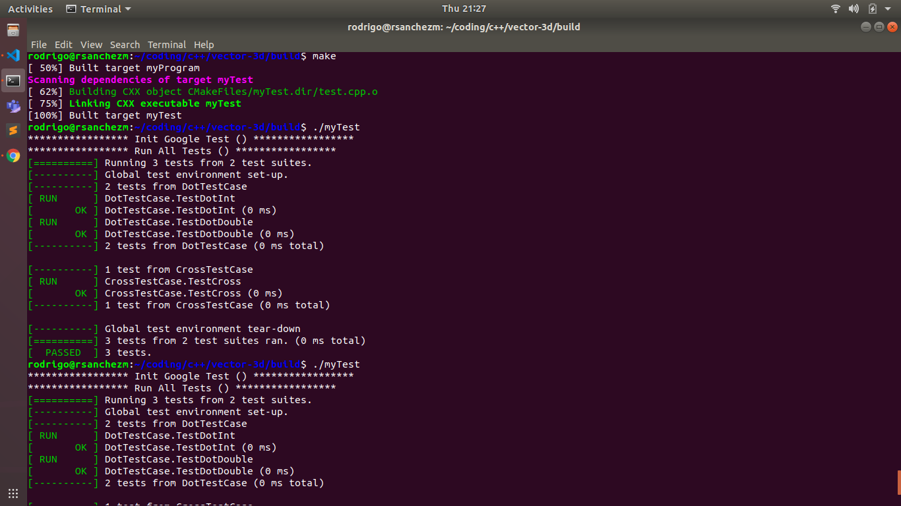

# 3D vector C++ class
A simple class implementation of a 3d vector [x,y,z] in C++.

## 3D vector utils
A template library that makes operations with the Vector3D class. They are under the vector_utils namespace.  

## GTest verification
To check the vector_utils.hpp functions between Vector3D vectors, there is implemented a test.cpp which uses google test to check its validity.



## Previous requirements
You need to have correctly installed gtest [Google Test GitHub](https://github.com/google/googletest) in order to use it.

## Build the programs 
```
mkdir build
cd build/
cmake ..
make
```

## Run the programs
```
cd build/
./myProgram
./myTest
```
